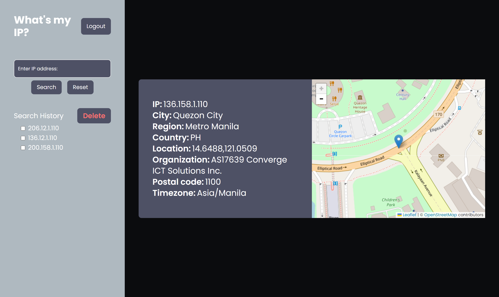

# What's my IP?

## Overview

This repository contains a sample mobile app built with React, utilizing a Node.js backend. The app includes a home screen that displays geolocation information based on the user's IP address.



### Node Version: 20.11.0

## Project Structure

## Frontend

### Installation

1. Navigate to the `client` directory:

   ```bash
   cd client

   ```

2. Install the dependencies::

   ```bash
   npm install

   ```

3. Run the development server:

   ```bash
   npm run dev
   ```
